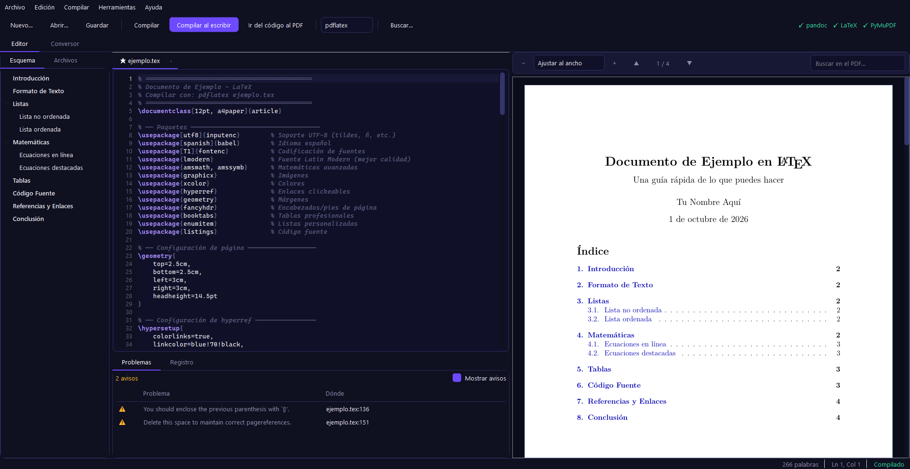
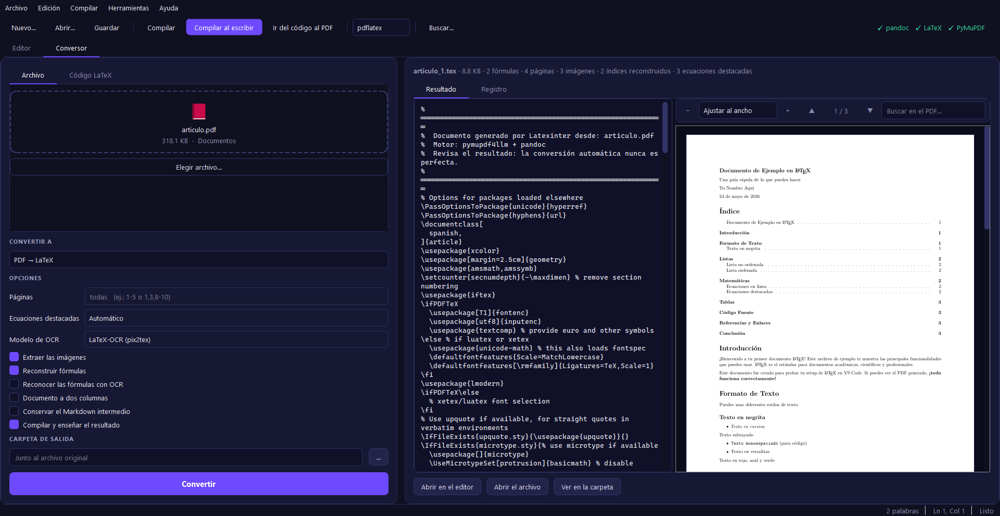

# Latexinter

*English · [Español](README.es.md)*

[](https://github.com/Wanderdank/Latexinter/actions/workflows/tests.yml)
[](LICENSE)

A desktop LaTeX environment that also converts between **PDF, LaTeX and Word**,
including the hard part: recovering the math formulas from a PDF. Everything
runs on your machine. There's no browser and nothing gets uploaded.

> The interface is in Spanish, and the document templates come with a Spanish preamble.



## Features

**Editor**
- Command and environment autocompletion, plus snippets (`\figura`, `\tabla`,
  `\ecuacion`, `\align`, `\matriz`…). `\begin{…}` inserts its own `\end{…}`.
- Syntax highlighting that tells commands, environments, math and comments
  apart, and marks multi-line formulas from start to end.
- Find and replace with regular expressions.
- Templates: article, report, Beamer slides, thesis, letter, CV and exam.

**Compiling**
- `F5` compiles. **Compile as you type** recompiles two seconds after you stop typing.
- `pdflatex`, `xelatex` or `lualatex`. Runs `bibtex`/`biber` and extra passes when needed.
- Errors from the `.log` (plus `chktex` style warnings) show up in a panel.
  Click one to jump to the line.
- **SyncTeX both ways:** `F7` jumps from the cursor to the PDF, and double-clicking the PDF jumps back to the source.
- The PDF keeps its scroll position between compiles.

**Converter**

| From  | To    | How |
|-------|-------|-----|
| PDF   | LaTeX | pymupdf4llm extracts the structure, then Latexinter rebuilds the formulas from the page layout |
| LaTeX | PDF   | pdflatex, with the passes needed for the table of contents and references |
| LaTeX | Word  | pandoc, with equations you can edit in Word |
| Word  | LaTeX | pandoc, including images and OMML equations |



## Recovering formulas from a PDF

A PDF doesn't store formulas, only glyphs at positions. A plain text extractor
returns `x2` for both "x times 2" and "x squared". Latexinter reads the geometry
and the fonts to work out what was lost:

- **Superscripts and subscripts** ([`pdfmath.py`](converters/pdfmath.py))
  compare each fragment's font size and baseline with the rest of the line and
  nest them by size, so `e⁻ˣ²` becomes `e^{-x^{2}}`.
- **Big operators:** TeX's math fonts store the integral sign in the slot of
  `Z` and the summation sign in the slot of `X`. Latexinter translates them back.
- **Display equations** are recognized because they're centered and set almost
  entirely in math fonts. Latexinter reassembles the pieces the extractor split up.
- **Unicode symbols** ([`mathfix.py`](converters/mathfix.py)): instead of
  `if $\alpha$ $\leq$ $\beta$`, it detects the whole math run and writes
  `if $\alpha \leq \beta$`.
- **Stacked formulas (OCR):** fractions leave no trace in a PDF's text, so
  `(-b ± √(b²-4ac)) / 2a` comes out as `−b±√b2−4ac2a`. Latexinter finds the
  fraction bars, crops the formula and runs it through
  [pix2tex](https://github.com/lukas-blecher/LaTeX-OCR). It reads at several
  resolutions and keeps the reading that repeats. It only uses OCR where
  there's a fraction, because on single-line math the layout reconstruction is
  more reliable.

With OCR, the quadratic formula above comes back as
`\frac{-b\pm\sqrt{b^{2}-4ac}}{2a}`, and a Taylor series as
`f(x)=\sum_{n=0}^{\infty}\frac{f^{(n)}(a)}{n!}(x-a)^{n}`.

It also cleans up the usual PDF debris:
- Running headers and stray page numbers.
- A dotted table of contents, replaced with `\tableofcontents`.
- The LaTeX logo broken into letters.
- Heading levels, worked out from the section numbers.

## Install

You need Python 3.12+, two external programs and a few packages:

```bash
winget install --id JohnMacFarlane.Pandoc
winget install --id MiKTeX.MiKTeX
pip install -r requirements.txt
python cli.py deps        # checks that everything is in place
python app.py
```

For formula OCR, install `pip install pix2tex` as well. It's about 1.5 GB because it pulls in PyTorch.

## Command line

```bash
python cli.py pdf2tex  paper.pdf --pages 1-6 --ocr
python cli.py tex2pdf  thesis.tex --engine xelatex
python cli.py tex2docx thesis.tex --toc
python cli.py docx2tex report.docx
```

## Tests

```bash
pip install pytest
python -m pytest tests -q
```

The text and formula cleanup tests only need Python. The end-to-end test
(`ejemplo.pdf` → LaTeX) is skipped automatically when pymupdf4llm and pandoc
aren't installed.

## Project layout

```
app.py, cli.py      desktop app and command line
ui/                 PyQt5 interface: editor, PDF viewer, panels, converter
converters/         the conversions, plus the formula reconstruction (pdfmath, mathfix, mathocr)
tests/              pytest
```

## License

[GNU AGPL v3](LICENSE).

Licenses of the dependencies:
- PyQt5 is GPL v3.
- PyMuPDF and pymupdf4llm are AGPL v3.
- pix2tex is MIT.
- Since version 1.27, pymupdf4llm also installs **pymupdf-layout**, which is
  *PolyForm Noncommercial*: free to use, but not for commercial purposes
  without a license from Artifex.
